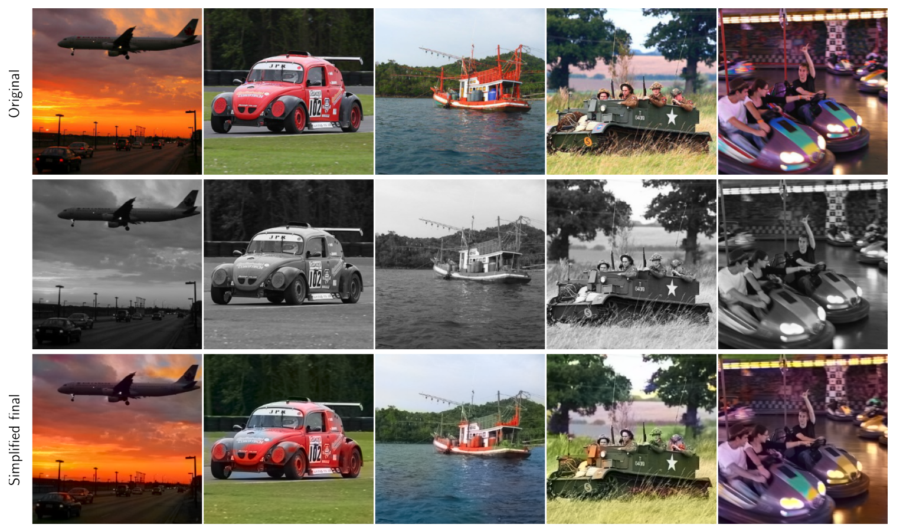
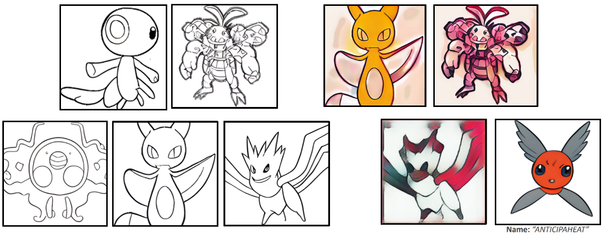
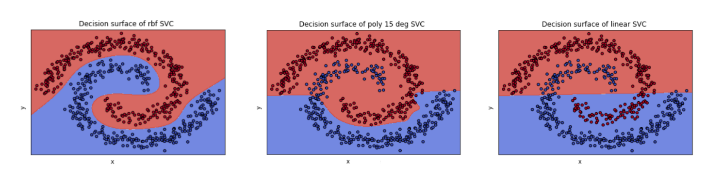
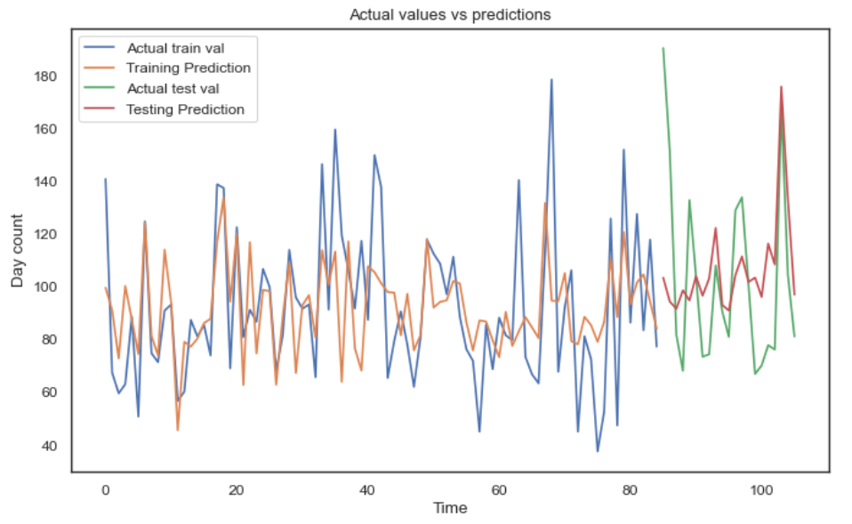
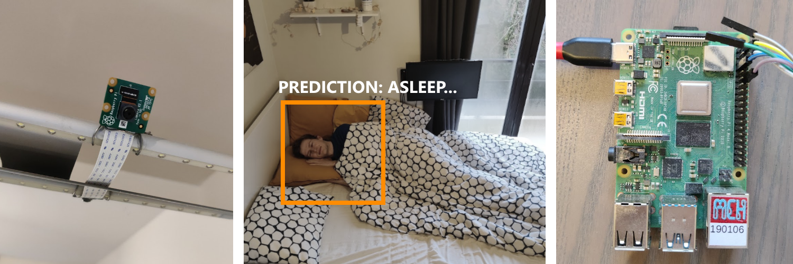

# Portfolio
Hi, I’m Fabian!

I’m a PhD student in Artificial Intelligence with a background in Computer Science and Applied Informatics. My research focuses on making deep learning models more trustworthy and reliable. I want to ensure that the models I train solve the actual problem, not just find shortcuts in the data. To achieve this, I explore different approaches, such as designing neural networks that are easier to interpret, measuring how certain models are in their predictions, and using special layers to guide the model's output.

Below, you will find some of the projects I have recently worked on. If you are interested in my profile, please visit my [LinkedIn](https://www.linkedin.com/in/fabian-denoodt/) page. 

Thank you for visiting!

### (Ongoing) Publications:

| Year | Title                                                        | Link                                                         | Venue                                                        |
| ---- | ------------------------------------------------------------ | ------------------------------------------------------------ | ------------------------------------------------------------ |
| 2024 | Smooth InfoMax - Towards easier Post-Hoc interpretability   | [Link](https://www.arxiv.org/abs/2408.12936)                 | Submitted at *International Conference on Acoustics, Speech, and Signal Processing* |
| 2024 | Label-Efficient Learning for Radio Frequency Fingerprint Identification | [Link](CPC4RFI.pdf)                                          | Submitted at *IEEE Wireless Communications and Networking Conference* |
| 2023 | Efficient Bayesian Ultra-Q Learning for Multi-Agent Games    | [Link](https://researchportal.vub.be/en/publications/efficient-bayesian-ultra-q-learning-for-multi-agent-games) | Published at *Adaptive and Learning Agents Workshop*         |

### [2024] [Two KUL AI courses in my spare time] 

Because a PhD alone wasn’t challenging enough, I enrolled for two extra courses at KU Leuven: **Evolutionary Algorithms** and **Uncertainty in AI** 🙂

- In the **Evolutionary Algorithms** course, I developed two solutions for the Traveling Salesman Problem: a classic selection-mutation-crossover approach and a more experimental gradient-descent-based method for discrete domains. In the experimental approach, I extended the Plackett-Luce model with a new probability representation, defined as a first-order Markov chain, as shown below:
  $$
  p_{\mathbf{W}}(\sigma) & =p(\sigma(1)) \cdot \prod_{t=2}^{n-1} p(\sigma(t) \mid \sigma(t-1)) \\
  & =\frac{1}{n} \prod_{t=2}^{n-1} \frac{\mathbf{W}_{\sigma(t) \mid \sigma(t-1)}}{\sum_{j=t}^n \mathbf{W}_{\sigma(j) \mid \sigma(t-1)}}
  $$
  However, while the method is mathematically sound, it doesn't really work that well in practice (that's the downside of working with less-established methods I guess 😅).

  - Report: [PDF](https://github.com/fdenoodt/evolution-assignment-2023-indiv/blob/main/text indiv/r0698535_final.pdf)

  - Code: [GitHub](https://github.com/fdenoodt/evolution-assignment-2023-indiv)

- The **Uncertainty in AI** was a theoretical course with a pen-and-paper exam.

## Master's projects as a CS student

### [2023] [Master's Thesis] Smooth InfoMax

Deep Neural Networks are inherently difficult to interpret, mostly due to the large numbers of neurons to analyze and the disentangled nature of the concepts learned by these neurons. Instead, I propose to solve this through interpretability constraints to the model, allowing for easier post-hoc interpretability. 

- This work has eventually led to the following research [paper](https://arxiv.org/abs/2408.12936).

- Code: [GitHub](https://github.com/fdenoodt/Smooth-InfoMax)

### [2023] [Deep Learning Course] Image colorization - Paper implementation

For a school group assignment, 2 fellow students and I implemented an image colorization model using PyTorch, based on the paper "Colorful Image Colorization" by Richard Zhang, Phillip Isola, and Alexei A. Efros. The paper proposes a method for converting grayscale images to color using an autoencoder-based Neural Network.

The images below show some of our results; **row 1:** ground truth images, **row 2:** grayscale images serving as input, and **row 3:** model predictions. It seems to work quite well.

Report: [PDF](https://github.com/WardGauderis/Image-Colourisation/blob/main/report.pdf)

Code: [GitHub](https://github.com/WardGauderis/Image-Colourisation)

### [2022] [Computational Creativity Course] - Pokémon Generator

For a computational creativity assignment, I generated fake Pokémon images using the open-source text-to-image model ruDALLE. I fine-tuned the model on images of a specific Pokémon type and also used the pretrained weights to generate outlines of Pokémon sketches. The generation of the names was also automated; the creative system took a few input words, made some permutations, and selected the best permutation, evaluated using a linear classifier trained on Pokémon names. The linear classifier then ranked the generated names and selected the most plausible option.

For more details, please take a look at our [paper](./pokemon_character_design.pdf).

### [2022] [Statistical Foundations of Machine Learning] - SVM research project

For this school group project, we were tasked to come up with three research questions and investigate them. One of the questions we focused on involved comparing the capability of different kernels in **support vector machines (SVM)** on non-linearly separable data. Specifically, the radial basis function (RBF), the polynomial, and the linear kernel were compared on a synthetic two-dimensional dataset. Given the image below, it appears that the RBF does best.

Code: [GitHub](https://github.com/WardGauderis/SFML)

### [2022]  [Actual Trends in Artificial intelligence] - Wine temperature prediction

A research project with a real business case for a real company (QelviQ), where the goal was to predict the optimal temperature for wine bottles based on their labels. The project was divided into three main modules: a computer vision module to extract text from the bottle labels, a data interpretation module that transformed the raw text into meaningful knowledge, and a temperature prediction module that used this information to predict the exact temperature. I worked on the data interpretation module, which involved extracting features such as the bottle name, year, wine name, and the regions of the included ingredients.

QelviQ is available via the following [link](https://eu.qelviq.com/).

<video src="assets/Video_Qelviq.mp4"></video>

### [2021] [Machine Learning] Kaggle competition - Appliances regression

I completed a machine learning project where I used regression techniques to predict the energy consumption of appliances in a house. I experimented with different regression models such as **linear regression**, **decision trees**, **boosting regression**, and **support vector regression**. I also went through the full machine learning pipeline, including data visualization, data preprocessing, cross-validation for time series data, feature engineering, and model training with parameter tuning. 

Code: [machine-learning-challenge/PROJECT.ipynb at master · fdenoodt/machine-learning-challenge (github.com)](https://github.com/fdenoodt/machine-learning-challenge/blob/master/PROJECT.ipynb)

### [2020-2021] Computer science bridging program

A one-year program that prepares students to start a master's program in computer science. The program consists of the core courses from the original three-year bachelor's program.

Included math courses:

- Calculus and linear algebra
- Discrete mathematics
- Probability and statistics
- Scientific mathematics

Included computer science courses:

- Structure of computer programs
- Interpretation of computer programs
- Algorithms and data structures 1
- Algorithms and data structures 2
- Logic and formal systems
- Automata and computability

### [2020] Image recognition alarm

Because waking up can be hard, I made a smart alarm to help me out. The alarm contains a camera that is pointed at my bed and detects when I sleep. When it is time to wake up, the alarm continues to play music while I stay in bed. Only when I walk out of bed, the alarm will stop. The alarm consists of a Raspberry Pi, a camera, and speakers. The front end is developed in `Angular`.

The Artificial Neural Network consists of a convolutional neural network developed in `python` using the `Keras` library.  

Github: [oBoii/alarm (github.com)](https://github.com/oBoii/alarm)

## Bachelor projects as an Applied Informatics student:

### [2020] 4-month internship as a Data Scientist in the Netherlands

I worked as an intern for the Data Analytics team of Achmea. Data scientists have previously developed an image recognition model. My job was to extend their current solution so that other employees could build their own machine-learning models. (Similar to AutoML). The developed product includes a web application, in which users can easily enter data and then train a model. In addition, several evaluation techniques have been implemented to assess the models. When a model does not perform satisfactorily, the application generates advice in one key sentence so that the end user can improve the model.

Grade: 16/20

Technologies:

- Data Science: Python, TensorFlow, Keras, YOLOv3
- Software development: Angular, .NET CORE, Azure Services (e.g. Azure Databricks, Azure Blob Storage)

Code: [fdenoodt/bachelorproef: 3TI - Big Data-projecten optimaliseren met AutoML (github.com)](https://github.com/fdenoodt/bachelorproef)

### [2019] Student job - Angular Developer
As front end developer for enterprise Organi, I helped the team by adding an extra module to their existing program, which their customers are currently using.

#### Technologies: 
* JavaScript
* Angular
* RxJS

#### Links:
* Organi: https://www.organi.be/en
* Result: https://imgur.com/a/Yoyt5c5

### [2019] School Project - TaskZone

A team project, with the objective of enhancing the communication/planning of teams.  
The application contains a chat service, similar to LinkedIn where you can send messages to a person/group.
The person receiving the message will then see 3 suggestions he can reply to that sentence.

#### Technologies: 
* C# (MVVM, Entity Framework)
* Python
* T-SQL

### [2019] Hackathon - WhatTheHack

2 day Hackathon, our objective was for awkward students to be able to make friends more easily.  
This we attempted to achieve by building a website, similar to Omegle but where the person gets matched with other students from the same school.  
If the conversation goes well they can add eachother as connection or if things go really well... even friends.

#### Links:
Github: https://github.com/oBoii/WhatTheHack-Hackathon

### [2018] Student job - Open Summer of Code
Project called "HealthStory", the objective was to make health related data more accessible.

#### Technologies: 
* JavaScript 
* React

### [2018] School project - World of Pong
Hybrid smartphone application, mark zones as 'Silent' / 'Loud'.
While in the zone, the phone will go into the preferred mode.

#### Technologies: 
* NodeJS 
* Socket.IO
* JavaScript
* Cordova

#### Links:
Video: https://www.youtube.com/watch?v=THXR1ZnCKiM

### [2018] A Silent Place - School project
Native android application, mark zones as 'Silent' / 'Loud'.  
When positioned in the zone, the phone will switch into the preferred mode.

#### Technologies: 
* Kotlin
* Firebase

#### Links:
Google Play: https://play.google.com/store/apps/details?id=be.ofabian.asilentplace

### [2018] UNO - School project
The game can be played solo against against bots.  
It can also be downloaded from my website to serve as an app for your phone.

#### Links:
Demo: https://ofabian.be/UNOv6

### [2017-2019] Management System - AMC Genk
Started as highschool project but is now being used profesionally by AMC-Genk + supported.  
Administration of:
Users, Reservations, Pictures / albums, Newsfeed, Sponsors / Advertisements
[AMC Genk image](http://ofabian.be/cv/map/amc.png)
###### Technologies: 
* JavaScript
* PHP
* Bootstrap

### [2017] Website - School project
Disability-friendly Website without use of frameworks.

#### Links:
* Website: http://ofabian.be/website_marc/

### [2017] Calendar - Home project
"I didn't feel like using Google's Calendar, so I built my own."

Project made for fun to fill in some time during my 3 month summer vacation.

### [2017] Static website - Traductions Marquant
A static website that shows information about the company (Bootstrap).

#### Links:
* Website: http://luc-marquant.be

### [2017] Internship - Horeca Technology Solutions
IT-Support helpdesk for 2 weeks.  
Company specialised in offering IT solutions in hotel and catering industry.

#### Links:
* Website: https://be.placedigger.com/horeca-technology-solutions-hts174251099.html
